Homework1 

### （1）创建一个新的Project，从Empty Activity创建

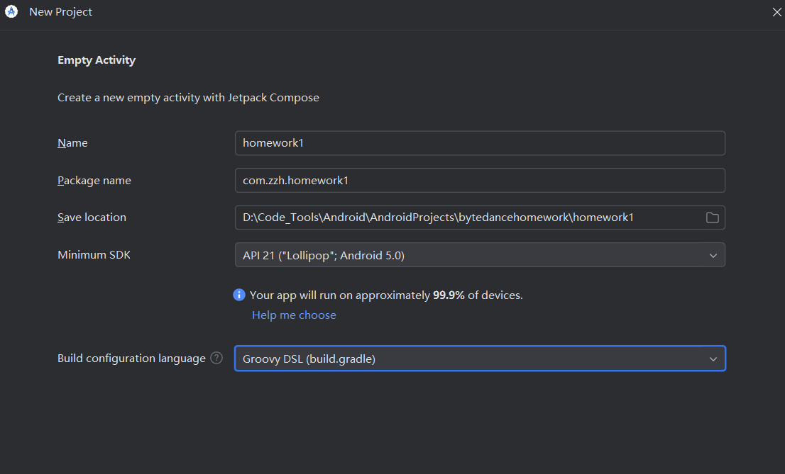

笔记：

1）package name中间为公司名称，指定唯一域名保证不冲突

2）Minimum SDK指定最小适配安卓版本

3）老师讲解build configuration language选groovy或kotlin无所谓，待自学

### （2）安卓第一个界面MainActivity

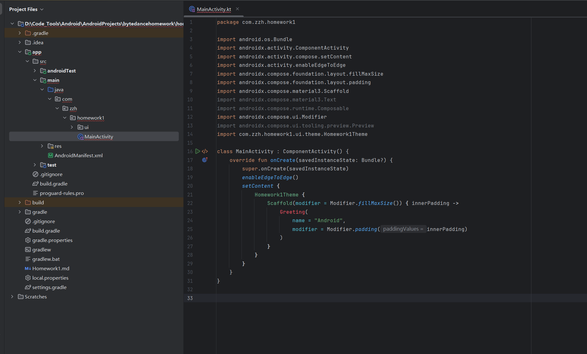

笔记：目前公司中compose并不是主流，依旧java为主，此处使用经典java代码

### （3）AndroidManifest.xml是注册文件，app中需要使用的页面都要在此进行注册。创建新工程时会自动注册MainActivity

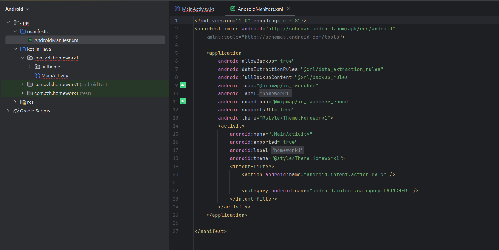

### （4）在代码区创建第二个activity页面，继承自Activity

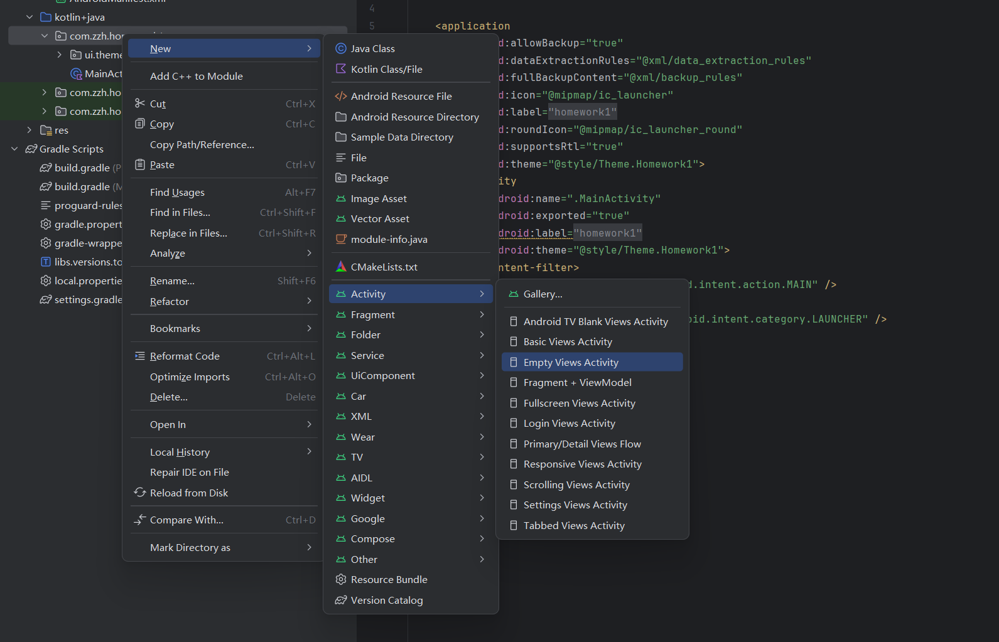

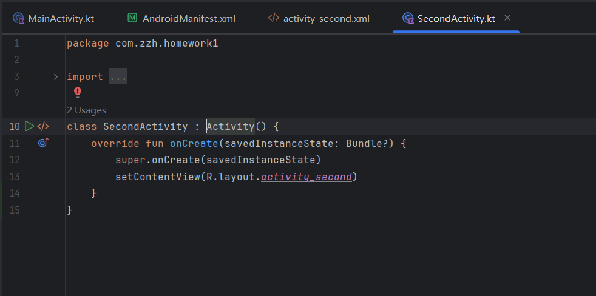

### （5）为MainActivity创建一个layout布局文件

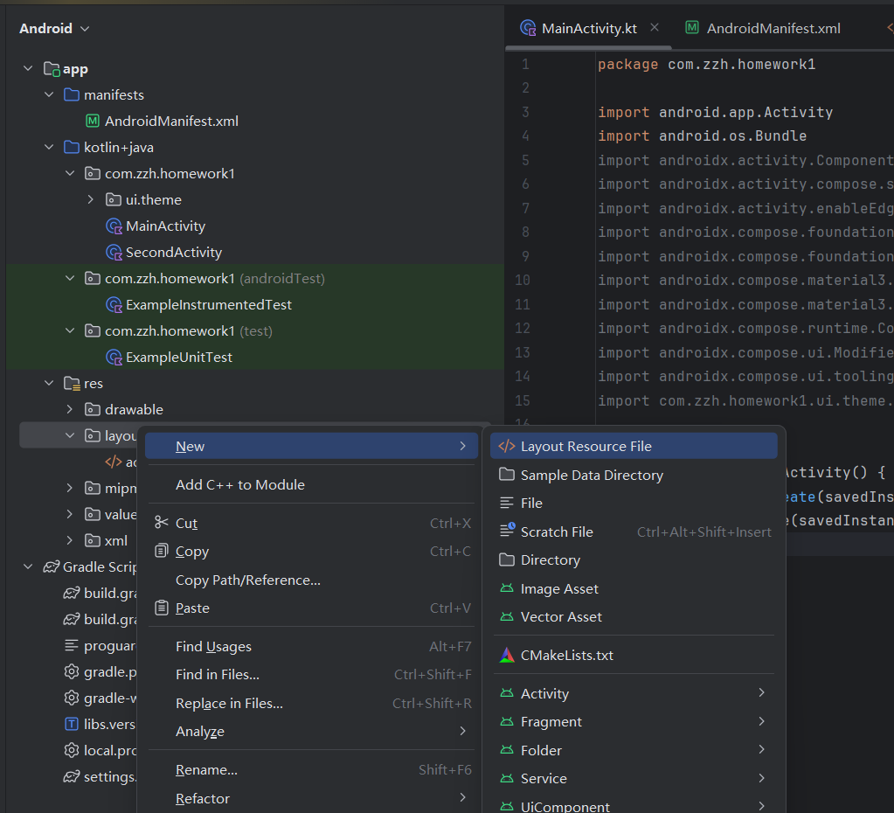

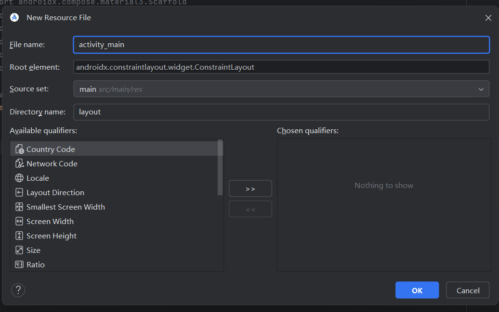

### （6）编辑xml文件，点击xml文件进入编辑后，右上角会出现code、split、和design模式。使用split可以同时通过代码编辑，并通过界面看到实时渲染效果。

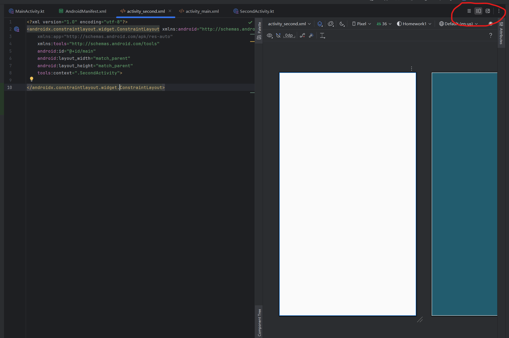

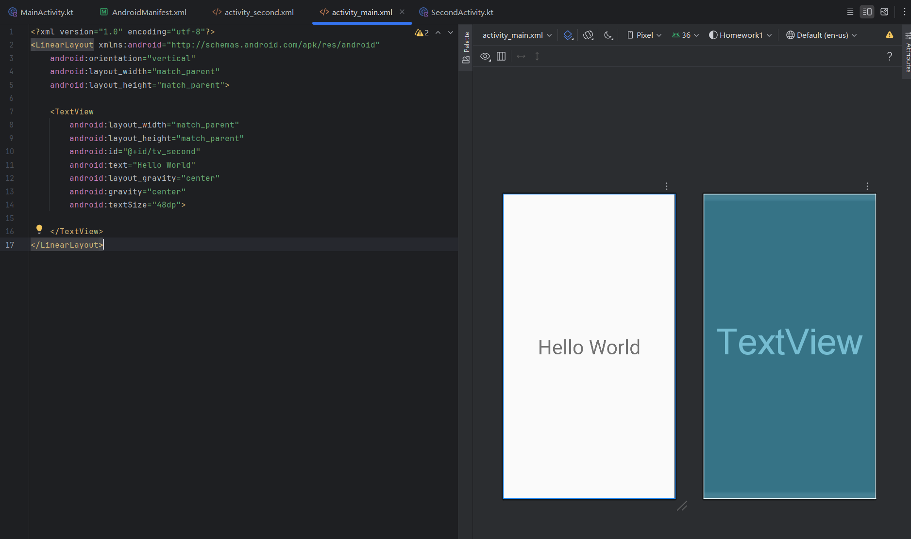

笔记：编辑代码时注意格式和封口，id方便代码引用，text代表实际显示的文字。

### （7）回到MainActivity.kt设置好刚刚写好的layout文件，并为里面的文件设置监听函数，同样配置好SecondActivity

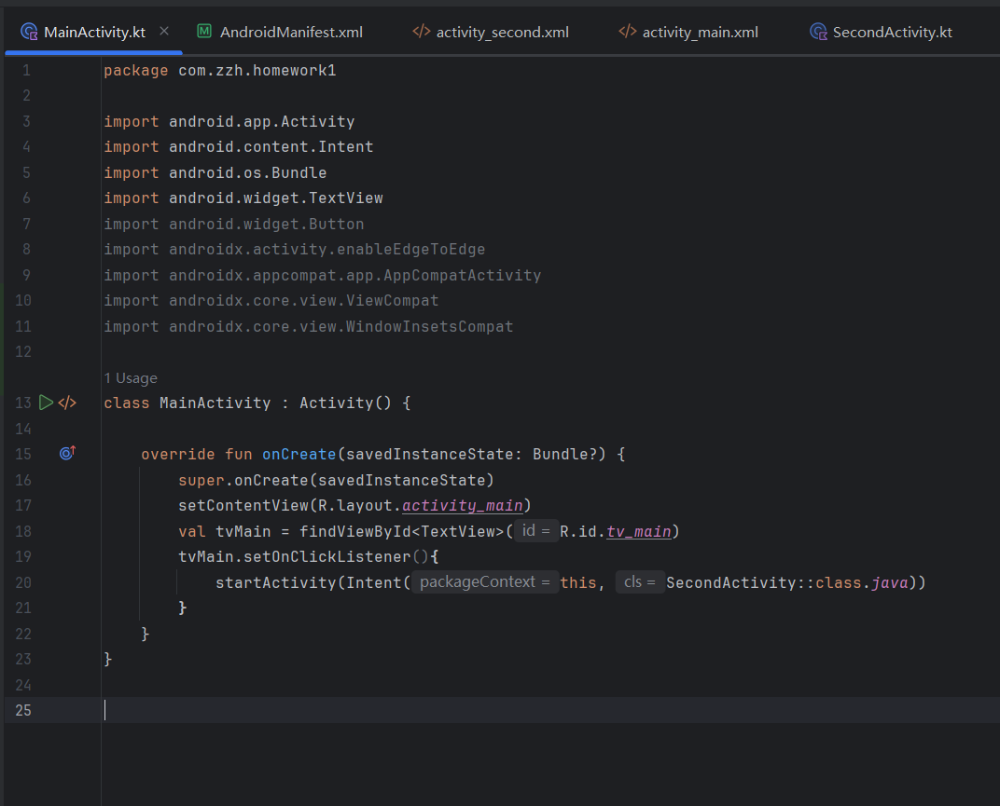

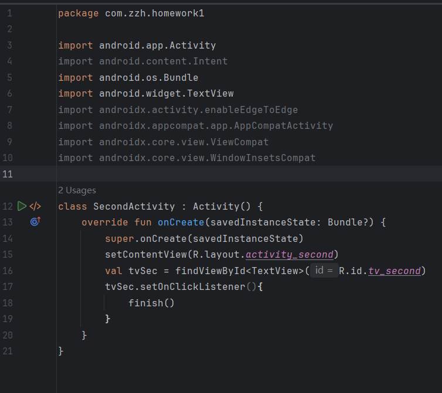

### （8）编译运行App，模拟器遇到无法打开问题参考https://blog.csdn.net/qq_37945670/article/details/145823743

<video src="./md_res/Screen_recording_20251122_140722.webm"></video>

### （9）重载除了onCreate以外的函数，比如onResume和onStop，可以看到演示中出现了底部弹窗。

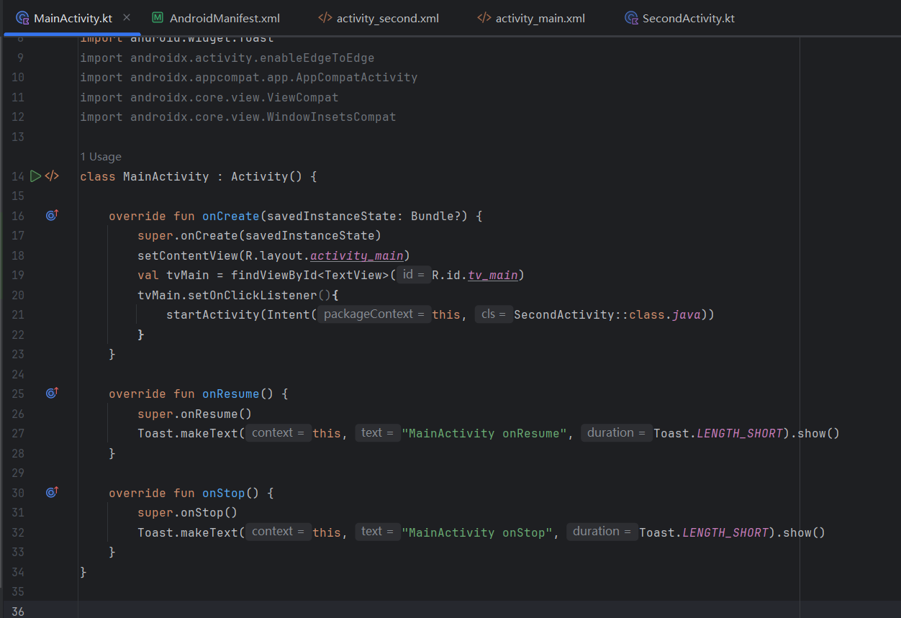

<video src="./md_res/Screen_recording_20251122_141829.webm"></video>
